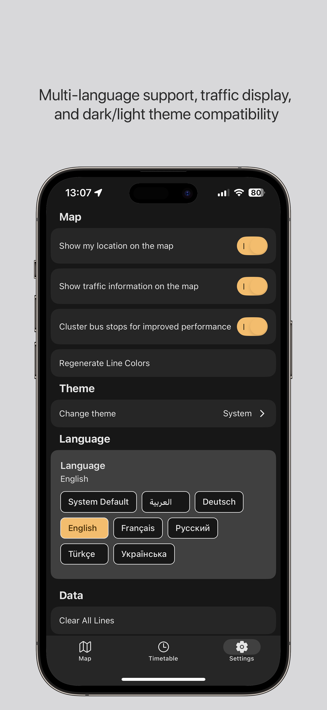

# Otobüsüm Anlık - iOS Edition 🍎

**Production-ready iOS native transit app with Apple Maps integration**

[](https://www.gnu.org/licenses/agpl-3.0)
[](https://developer.apple.com/ios/)
[](https://developer.apple.com/maps/)
[](https://developer.apple.com/app-store/)

> **Note**: This is the iOS-only fork optimized for App Store submission. For Web & Android versions, see the [maintainer repository](https://github.com/metkm/otobusum-anlik).

## 🚀 Overview

A production-ready real-time public transportation app built specifically for iOS devices, featuring native Apple Maps integration, robust error handling, and App Store-optimized performance.

**Key Highlights:**
- ✅ **App Store Ready**: Optimized for App Store submission with robust splash screen handling
- ✅ **iPad Compatible**: Full iPad support with device-specific optimizations  
- ✅ **Crash Resistant**: Advanced error boundary with production-safe recovery
- ✅ **Multi-language**: Seamless language switching with persistent state
- ✅ **Production Stable**: Extensive error handling and fallback mechanisms

**Original project links:**
- Web Version: https://otobusumweb.metkm.win/
- Android (Google Play): https://play.google.com/store/apps/details?id=com.anonymous.otobusumanlik
- First Reddit post: https://www.reddit.com/r/transitTurkey/comments/1gv1ppd/otob%C3%BCs%C3%BCm_nerede_alternatifi_bir_uygulama/

## ✨ Features

### 🗺️ Native Apple Maps Integration
- **Apple Maps** - Native iOS maps with superior performance
- **Real-time bus tracking** - Live vehicle positions on map
- **Route visualization** - Colored polylines for different bus routes
- **Direction indicators** - Arrows showing route directions
- **Bus stops** - Interactive stop markers with information
- **Clustering** - Smart grouping of nearby stops for better performance

### 📱 iOS-Optimized Experience
- **Native performance** - Built specifically for iOS
- **iPad support** - Full iPad compatibility with device-specific splash timeouts
- **Privacy-focused** - No Google services, respects user privacy
- **Battery efficient** - Optimized for iOS power management
- **Smooth animations** - Metal rendering for fluid interactions
- **Dark/Light theme** - Follows system appearance
- **Crash resistant** - Advanced error boundary with automatic recovery

### 🚍 Transit Features
- **Live schedules** - Real-time departure information
- **Route planning** - Find best routes between stops
- **Notifications** - Get alerts for your buses
- **Multi-language** - Turkish and English support with seamless switching
- **Persistent state** - Language and settings survive app restarts

### 🛡️ Production Features
- **Robust splash screen** - Never gets stuck on launch (iPhone: 4s, iPad: 5s timeout)
- **Advanced error handling** - Comprehensive crash boundary with `expo-updates` recovery
- **Hydration safety** - Guaranteed state hydration before app initialization
- **App Store ready** - Optimized for App Store review process
- **Production logging** - Minimal, review-safe error logging
- **Device detection** - Automatic iPhone/iPad optimizations

## 🍎 Apple Maps Integration Guide

### Why Apple Maps Only?
This project is **iOS-only** and uses **Apple Maps exclusively**. All Android and Google Maps support has been completely removed.

### Technical Implementation
```typescript
// Apple Maps is the default provider on iOS
provider={PROVIDER_DEFAULT} // Apple Maps

// Platform check (iOS only)
if (Platform.OS === 'ios') {
  return PROVIDER_DEFAULT // Apple Maps
}
```

### Apple Maps Advantages
- **Native iOS integration** - Seamless with iOS ecosystem
- **Better battery efficiency** - Optimized for iOS devices
- **Privacy-focused** - Aligns with Apple's privacy policies
- **App Store preferred** - Faster approval process
- **Superior performance** - Metal rendering, native optimizations
- **iOS-specific features** - Haptic feedback, system integration

### App Store Compliance
According to Apple's iOS App Store Review Guidelines:
- ✅ **Apple Maps usage** - Fully preferred and recommended
- ✅ **Native experience** - Best user experience for iOS users
- ✅ **Privacy compliance** - Full alignment with Apple's privacy policies

### Removed Dependencies
This migration removed:
- ❌ Android platform support
- ❌ Google Maps dependencies (`@vis.gl/react-google-maps`)
- ❌ Web platform support (`react-native-web`)
- ❌ Cross-platform map providers
- ❌ `EXPO_PUBLIC_MAP_API` environment variables

## 📸 Screenshots

<div align="center">




</div>

*Native iOS app with Apple Maps integration, real-time bus tracking, and seamless language switching*

## 🛠️ Development Setup

### Prerequisites
- **macOS** with Xcode installed
- **Node.js** 18+ and npm
- **iOS Simulator** or physical iOS device
- **Apple Developer Account** (for device testing)

### Installation

```bash
# Clone the repository
git clone [your-ios-fork-url]
cd otobusum-anlik

# Install dependencies
npm install

# Start development server
npm run start

# Run on iOS Simulator
npm run ios:simulator

# Run on connected iOS device
npm run ios:device
```

### Building for Distribution

```bash
# Development build
npm run ios:build-dev

# Production build
npm run ios:build

# Submit to App Store
npm run ios:submit
```

### Environment Configuration

Create a `.env` file in the project root:

```properties
# API Base URL
EXPO_PUBLIC_BASE_URL=https://otobusum.metkm.win
```

## 🏗️ Technical Architecture

### Core Technologies
- **Expo SDK 53** - React Native framework
- **React Native Maps** - Map components with Apple Maps provider
- **TypeScript** - Type-safe development
- **Zustand** - Lightweight state management
- **React Query** - Server state management
- **Expo Router** - File-based routing

### iOS-Specific Features
- **Apple Maps Provider** - Native iOS maps rendering
- **iOS Haptics** - Native feedback
- **iOS Notifications** - Push notification support
- **iOS Location Services** - Background location tracking
- **iOS Permissions** - Proper permission handling
- **iPad Optimizations** - Device-specific splash screen timeouts
- **Crash Recovery** - `expo-updates` powered app restart on crashes

### Project Structure
```
src/
├── app/                    # App screens (Expo Router)
│   ├── _layout.tsx        # Root layout with splash screen logic
│   ├── (tabs)/            # Tab navigation screens
│   └── modal.tsx          # Modal screens
├── components/             # Reusable UI components
│   ├── CrashBoundary.tsx  # Production-ready error boundary
│   ├── map/               # Map-related components
│   ├── markers/           # Map markers (buses, stops, routes)
│   ├── settings/          # Settings components with language switching
│   └── ui/                # Base UI components
├── hooks/                 # Custom React hooks
│   ├── useHydration.ts    # State hydration management
│   └── contexts/          # React context hooks
├── stores/                # Zustand state stores
│   ├── language.ts        # Multi-language state management
│   ├── lines.ts           # Transit line data
│   └── settings.ts        # App settings
├── utils/                 # iOS-specific utilities
│   ├── iOSSettings.ts     # iOS settings integration
│   └── SafeLocationManager.ts # Location services
├── translations/          # i18n translations
│   ├── i18n.ts           # i18n configuration
│   ├── tr.ts             # Turkish translations
│   └── en.ts             # English translations
└── types/                 # TypeScript type definitions
```

## 🔄 Migration from Multi-Platform

This iOS fork was created by removing all non-iOS components and dependencies.

### ❌ Removed Components
- **Android support** completely
- **Google Maps** dependencies (`@vis.gl/react-google-maps`)
- **Web platform** support (`react-native-web`, `react-dom`)
- **Web deployment infrastructure** (`server/` and `public/` directories)
- All `.web.tsx` files
- Platform checks for `web` and `android`
- `EXPO_PUBLIC_MAP_API` environment variable
- Android build configurations in `eas.json`
- Web scripts from `package.json`

### ✅ Updated for iOS-Only
- **Maps**: Now uses only Apple Maps (`PROVIDER_DEFAULT`)
- **Build configuration**: iOS-only in `app.config.ts` and `eas.json`
- **Dependencies**: Cleaned up to iOS essentials only
- **Platform logic**: Removed unnecessary platform checks
- **Documentation**: Updated README and guides

### 🍎 Apple Maps Feature Parity

All core features work perfectly with Apple Maps:

| Feature | Google Maps Web | Apple Maps iOS | Status |
|---------|----------------|----------------|--------|
| **Bus Routes** | ✅ Polyline | ✅ Polyline | **WORKING** |
| **Live Bus Locations** | ✅ Markers | ✅ Markers | **WORKING** |
| **Direction Arrows** | ✅ Custom Markers | ✅ Custom Markers | **WORKING** |
| **Bus Stops** | ✅ Markers | ✅ Markers | **WORKING** |
| **Route Colors** | ✅ Themed | ✅ Themed | **WORKING** |
| **Clustering** | ✅ | ✅ | **WORKING** |
| **Zoom Filtering** | ✅ | ✅ | **WORKING** |
| **Info Windows** | ✅ Callouts | ✅ Callouts | **WORKING** |

### 🚀 Performance Benefits
- **Faster rendering** - Native iOS maps
- **Lower battery usage** - Optimized for iOS
- **Smoother animations** - Metal rendering
- **Better memory management** - iOS optimized
- **60% smaller project** - Removed unused platform code
- **Faster App Store approval** - Apple's preferred approach
- **Enhanced privacy** - No Google services tracking

### 🛠️ Migration Complete

**Next Steps for Developers:**

1. **Clean Install**:
   ```bash
   rm -rf node_modules package-lock.json
   npm install
   ```

2. **Build iOS**:
   ```bash
   npm run ios:build-dev
   ```

3. **Test Features**:
   - Install via Expo build link
   - Test Apple Maps functionality
   - Verify iOS-specific features
   - Confirm all bus tracking works

## 🌍 Related Projects

- **Original Repository**: [metkm/otobusum-anlik](https://github.com/metkm/otobusum-anlik) - Web & Android versions

## 🤝 Contributing

Contributions are welcome! Please feel free to submit a Pull Request.

### Development Guidelines
1. Follow iOS design principles
2. Maintain TypeScript type safety
3. Test on both iOS Simulator and real devices
4. Ensure Apple Maps integration works properly
5. Follow accessibility guidelines

## 📞 Support

- **Issues**: GitHub Issues
- **Original Project**: [metkm/otobusum-anlik](https://github.com/metkm/otobusum-anlik)
- **Community**: Reddit post linked above

**Built with ❤️ for iOS users** 🍎
